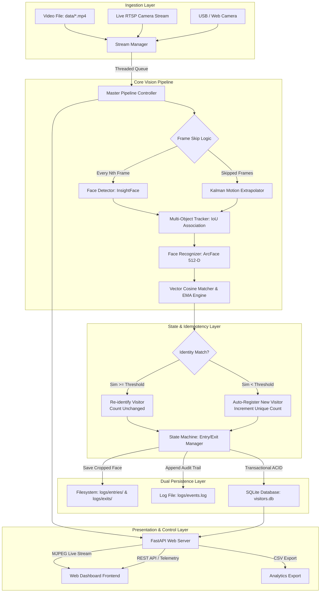
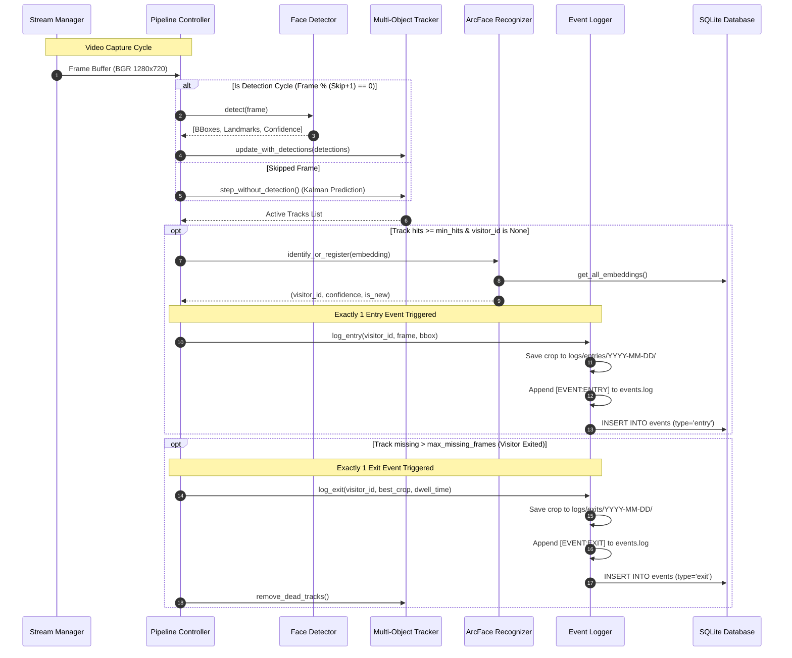
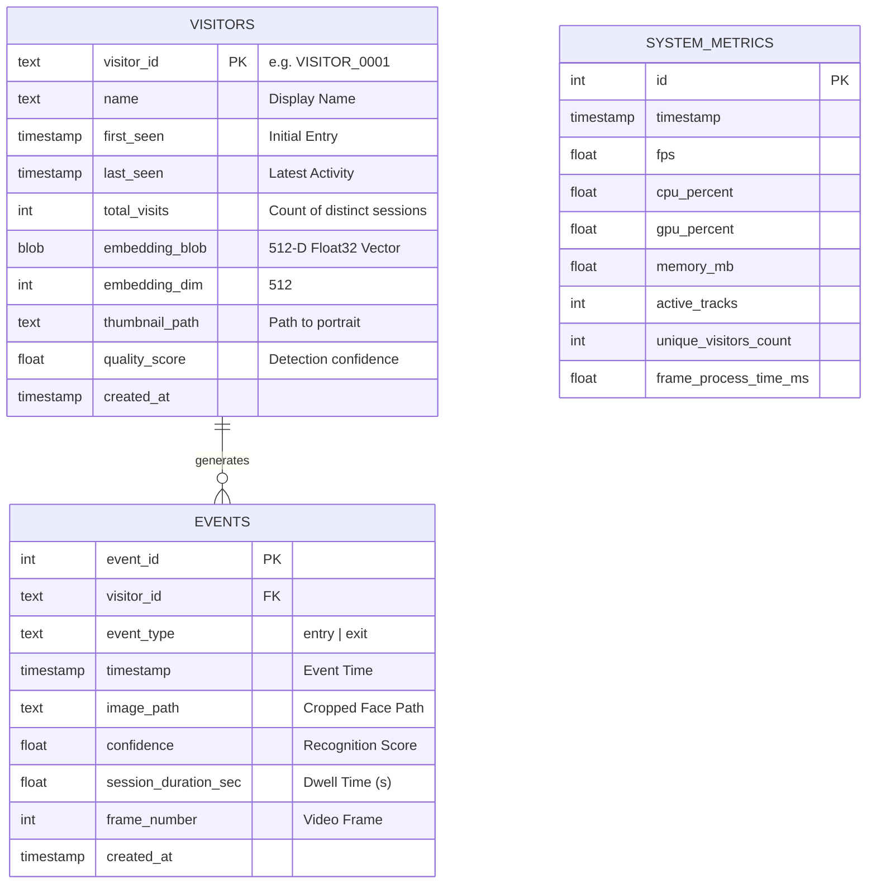

# System Architecture & Technical Specifications

## 1. High-Level Modular Architecture

The system is designed with a decoupled, thread-safe, multi-tiered architecture ensuring real-time responsiveness, modularity, and crash resilience.

---

## 2. Sequence Diagram: Face Entry & Exit Lifecycle

---

## 3. Database Entity-Relationship Diagram (ERD)

